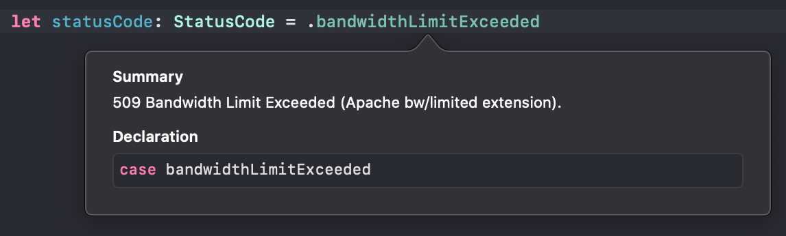

# StatusCode

List with all http status codes .



# Usage

## Swift Code

Copy ans paste file `StatusCode.swift` your project. 

```swift

let status = .accepted

```

## Objetive-C Code

Copy and paste header file `HTTPStatusCodes.h` your project.

```objc

HTTPStatusCode status = kHTTPStatusCodeAccepted;

```

# License

StatusCode is available under the MIT license. See the LICENSE file for more info.